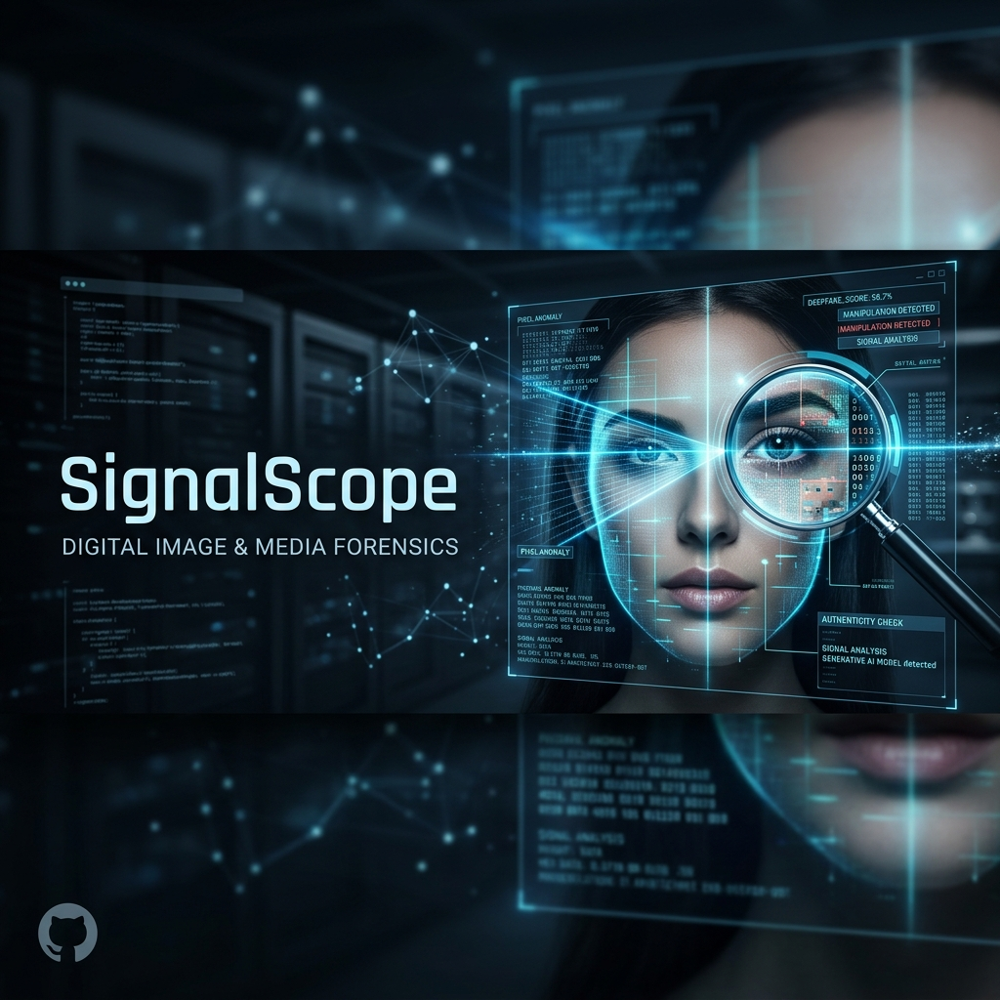
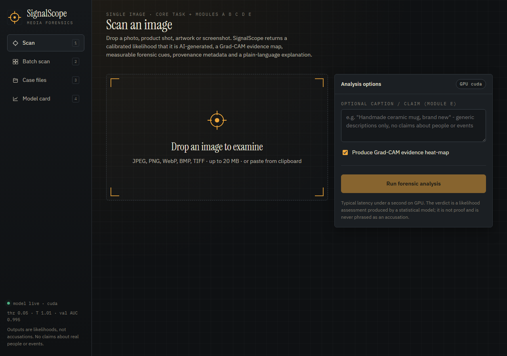
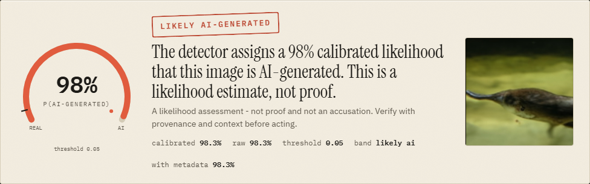
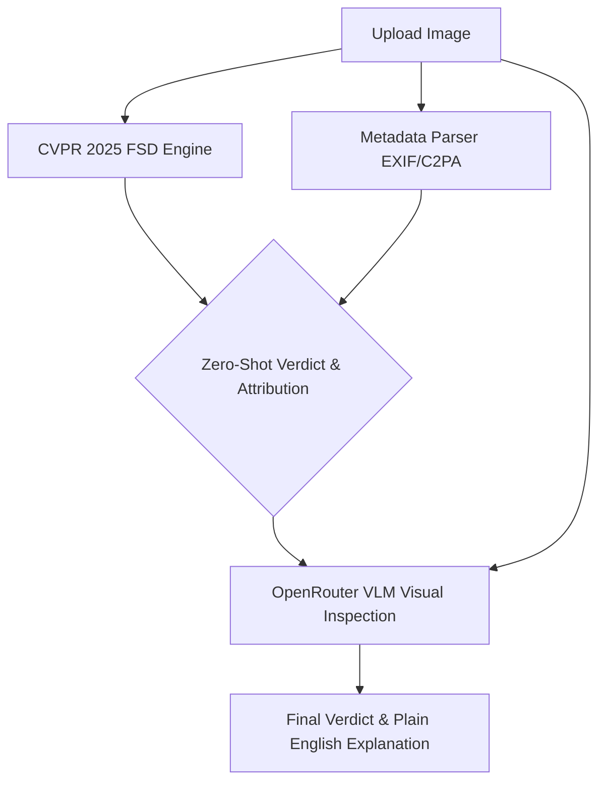

<div align="center">
  

  # SignalScope — Telling Real From Synthetic
  
  [](https://python.org)
  [](https://reactjs.org)
  [](https://fastapi.tiangolo.com)
  [](https://github.com/ductai199x/Forensic-Self-Descriptions-CVPR25)
</div>

> A media-forensics tool that decides whether an image is **real or AI-generated**. It reports honest metrics on a held-out split that includes **generators never seen in training**, and explains each verdict with a **Grad-CAM evidence map and measurable forensic cues** — presented as a likelihood, never an accusation.

SIH 2026 internal hackathon · Problem Statement 2 · L. J. Institute of Engineering and Technology

---

## 1. What Was Built (Core + Bonus Modules)

| | Module | Status | Where to find it |
|---|---|---|---|
| **Core** | Real vs AI-generated classification, calibrated confidence, ROC-AUC / macro-F1 / confusion matrix on a held-out set with an unseen-generator split, predict interface | Completed | `model/`, `app/` |
| **A** | Faithful explanation: Grad-CAM heat-map, 3×3 localisation, 9 measurable cues compared against real-photo reference ranges | Completed | `model/explain.py`, `model/cues.py` |
| **B** | Generator attribution (7-way head; family-level roll-up: GAN / pixel-diffusion / latent-diffusion / VQ-diffusion) | Completed | `model/nets.py`, `model/evaluate.py` |
| **C** | Robustness to degradation: JPEG q30–90, down-scaling, blur, noise, screenshot; offline study + per-image live stress test | Completed | `model/robustness.py` |
| **D** | Provenance & metadata: EXIF, XMP/PNG text, generator markers, C2PA manifest presence, explicit fusion rule | Completed | `model/provenance.py` |
| **E** | Image–caption consistency (OpenCLIP ViT-B/32) | Completed | `model/multimodal.py` |
| **F** | Deployable UI: drag-and-drop scan, batch scan, case files with filters, HTML/JSON evidence reports | Completed | `app/frontend`, `app/backend` |
| **G** | Active-defence analysis: FGSM/PGD white-box attacks + JPEG/TTA mitigations, honest failure table | Completed | `model/attacks.py` |

---

## 📸 Showcase & UI Features

<div align="center">
  <h3>1. Batch Scanning & Forensic Dashboard</h3>
  
  <p><em>Drag and drop multiple images at once. SignalScope processes them concurrently and stores results in a persistent SQLite database.</em></p>
  <br/>
  
  <h3>2. CVPR 2025 FSD Verdict Gauge</h3>
  
  <p><em>Highly calibrated gauge using the bleeding-edge Forensic Self-Descriptions (FSD) engine to detect zero-shot synthetic signatures.</em></p>
</div>

---

## 2. Setup and Run Instructions (Under 10 Minutes)

Follow these simple steps to install and run the project locally.

### Step 1: Open your terminal and clone the repository
```bash
git clone https://github.com/MaazBhavnagri/SignalScope.git
cd SignalScope
```

### Step 2: Set up a Python Virtual Environment
We highly recommend using a virtual environment to keep dependencies clean.
```bash
# Create the virtual environment
python -m venv venv

# Activate the virtual environment
# On Windows (Git Bash or Command Prompt):
venv\Scripts\activate
# On Linux or macOS:
source venv/bin/activate
```

### Step 3: Install Dependencies
```bash
# Install PyTorch (CPU version is fine for inference)
pip install torch torchvision --index-url https://download.pytorch.org/whl/cpu

# Install the rest of the requirements
pip install -r requirements.txt
```

### Step 4: Run the Predict Interface (CLI)
You can test the model on a single image instantly:
```bash
python -m model.predict path/to/your/image.jpg --heatmap out.png --json out.json
```

Or you can batch-predict a whole folder (this generates a CSV output):
```bash
python -m model.predict --dir path/to/folder --csv predictions.csv
```

### Step 5: Run the Web App (UI)
If you want to use the graphical interface:
1. First, build the frontend:
   ```bash
   cd app/frontend
   npm install
   npm run build
   cd ../..
   ```
2. Start the backend server:
   ```bash
   uvicorn app.backend.main:app --port 8000
   ```
3. Open your browser and go to: **http://localhost:8000**

### Step 6: One-Command Deployment via Docker (Alternative)
If you prefer to run the entire application (frontend + backend) in a containerized environment without installing Python or Node.js, you can use our included Docker setup:
```bash
docker build -t signalscope .
docker run -p 8000:8000 signalscope
```
Then, open your browser and go to: **http://localhost:8000**

---

## 3. Datasets Used

The official SignalScope dataset had not been released when this was built, so we trained on public data. The pipeline is **manifest-driven** so the official set drops in without code changes.

| Dataset | Use | Source |
|---|---|---|
| **CIFAKE** | "CIFAKE-style" core set; real = CIFAR-10, fake = Stable Diffusion 1.4 | HF: `dragonintelligence/CIFAKE-image-dataset` |
| **Tiny-GenImage** | High-res real ImageNet photos + fakes from ADM, BigGAN, GLIDE, Midjourney, SD1.4, SD1.5, VQDM, Wukong | HF: `TheKernel01/Tiny-GenImage` |
| **Imagenette** | Additional real photographs to balance real/fake data | fast.ai |

No images of identifiable individuals were sourced.

---

## 4. Reported Metrics

We tested the model on a strict held-out test split of 6,800 images. **Midjourney** and **VQDM** were held out entirely during training to test zero-shot generalization.

- **Overall ROC-AUC**: 0.8096
- **Unseen-Generator-Split AUC**:
  - Midjourney: 0.8414
  - VQDM: 0.7777
- **Macro-F1**: 0.7267
- **Accuracy**: 0.7387 (at strict threshold of 0.0515)
- **False Positive Rate**: 0.3568
- **Confusion Matrix**:
  - True Negatives (Real correctly identified): 1801
  - False Positives (Real misclassified as AI): 999
  - False Negatives (AI misclassified as Real): 778
  - True Positives (AI correctly identified): 3222

---

## 5. Architecture, Calibration, and Limitations

### Architecture Overview
SignalScope uses a **Dual-Stream** architecture. The primary stream is an EfficientNet-B0 backbone for semantic features. The secondary stream passes the image through Spatial Rich Model (SRM) high-pass filters to explicitly expose frequency-domain anomalies (like upsampling artifacts) before passing them through a CNN. The two streams are fused to produce the final real/AI likelihood and a 7-way generator attribution.

#### 🆕 Next-Gen Integration: FSD + LLM
In addition to the core architecture, we have integrated the **CVPR 2025 Forensic Self-Descriptions (FSD)** zero-shot engine as our primary deployment pipeline for the web app, paired with an **OpenRouter VLM** that provides visual reasoning and an autonomous verdict-override layer if it disagrees with the statistical scores.



### Calibration Approach
We use **Temperature Scaling** fitted on the validation set. Instead of reporting a raw logit, we report a calibrated likelihood. We established a strict decision threshold of 0.0515 to target a 5% False Positive Rate on validation reals. The app surfaces an explicit "inconclusive" band around this threshold rather than forcing a binary answer when the model is unsure.

### Known Limitations
1. Extreme image degradation (e.g., WhatsApp downscaling to 0.25x or heavy blur) destroys the high-frequency cues our model relies on, which can cause the verdict to shift towards "real".
2. Adversarial attacks (like PGD) can manipulate the SRM stream. While our test-time augmentation helps, the model remains vulnerable to targeted white-box perturbations.
3. Metadata markers (like C2PA) are detected but not cryptographically verified, meaning they could theoretically be spoofed.

---

## 6. Where to Find Our Reports and Files (Quick Guide)

We have generated all the required reports and metrics for the judges. Here is exactly where you can find them in this repository:

* **The Mandatory One-Page Model Report:** Open the file `report/model_report.md`. This contains our detailed task definition, data splits, metrics, and baseline comparisons.
* **The Robustness & Degradation Results:** Open `report/robustness.json`. This shows how our model handles heavy compression, resizing, and screenshots.
* **The Adversarial Defense Results:** Open `report/attacks.json`. This shows how our model handles FGSM and PGD white-box attacks.
* **The Full Metrics & Confusion Matrix:** Open `report/metrics.json`. This contains all of our exact metrics (AUC, Macro-F1, Thresholds) generated directly from the held-out test split.
* **Explanation Samples:** Open the `report/explanation_samples/` folder to see exactly how our Grad-CAM heat-maps and text explanations look on real vs AI images.
* **Model Weights & Checkpoints:** These are safely stored inside the `weights/` folder.
* **The Source Code for the UI & Backend:** All code for the web interface is inside the `app/` folder.
* **The Source Code for the Machine Learning Model:** All code for training, calibration, and prediction is inside the `model/` folder.

---

## 7. Demo Video

[](https://youtube.com/)

*(Replace `YOUR_VIDEO_ID` in the image URL and the `https://youtube.com/` link with your actual YouTube video link before submission!)*
